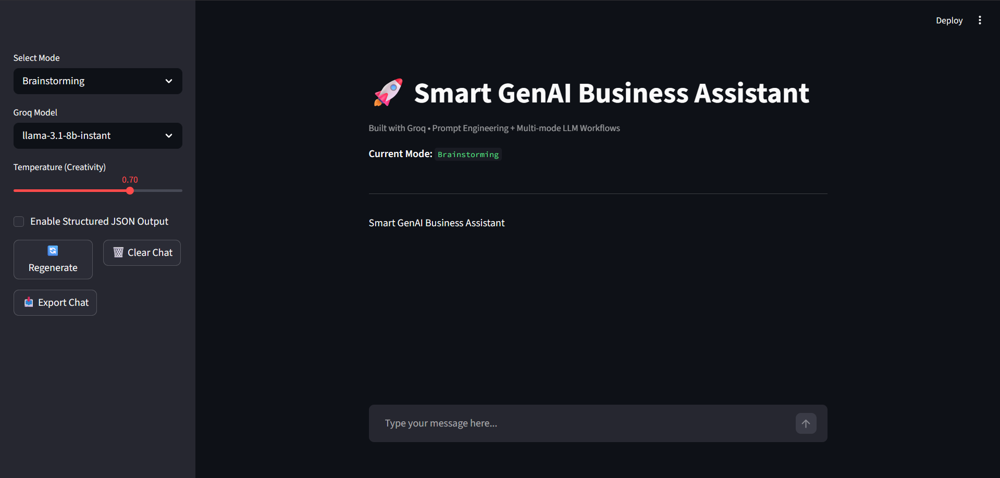

# 🚀 Smart GenAI Business Assistant

A practical multi-mode GenAI chatbot built with **Groq** and **Streamlit**.  
This project demonstrates real-world application of Prompt Engineering, LLM API integration, conversational memory, and rapid prototyping — perfect for showcasing applied GenAI skills.

## 💼 Business Value

This assistant is designed to solve common business communication and productivity needs by generating high-quality responses instantly.

### Key business use cases:
- Drafting **professional emails**
- Writing **business proposals and reports**
- Generating **marketing and sales copy**
- Creating **summaries of long content**
- Answering questions in a **helpful assistant/chatbot style**
- Improving productivity with **multi-mode AI workflows**

This makes the project useful for:
- **Startups**
- **Freelancers**
- **Small businesses**
- **Customer support teams**
- **Content and marketing workflows**

### Live Demo
https://your-app-name.streamlit.app

### Screenshots


### Features
- **3 Practical Business Modes**:
  - **Customer Support**: Empathetic, solution-oriented query handling
  - **Content Creation**: Marketing copy, LinkedIn posts, emails, product descriptions
  - **Brainstorming**: Idea generation, campaign concepts, strategy & problem-solving
- Conversational memory (remembers chat history in the session)
- Groq model switching (Llama 3.3, Llama 3.1, Mixtral)
- Temperature control for creativity
- Structured JSON output option
- Regenerate last response
- Export chat as TXT file
- Clean, professional Streamlit UI

### Tech Stack
- **Groq API** — Fast & free LLM inference
- **Streamlit** — End-to-end web app prototyping
- Python + `dotenv` for secure API key management

### Skills Demonstrated
- Advanced **Prompt Engineering** (tailored system prompts per mode)
- **LLM API Integration & Workflows** (Groq client, model switching, error handling)
- **Conversational AI & Memory Management**
- Rapid **End-to-End App Building** with Streamlit
- Structured outputs and iterative refinement

### How to Run Locally
1. Clone the repository
2. Create a `.env` file and add your `GROQ_API_KEY`
3. Install dependencies:
   ```bash
   pip install streamlit groq python-dotenv

## Author

**Atharva Thakur**  
🔗 [LinkedIn](https://linkedin.com/in/atharva-thakur-585579252)  